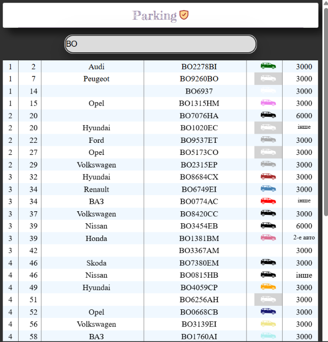

# Car Checker 🚗📱

A simple and efficient SPA designed for residents of an apartment building to quickly identify parked vehicles.

## 📋 About the Project

The idea for this application arose from the need to monitor the parking space of a residential building. The app allows residents to verify whether a car parked overnight belongs to a neighbor or a guest.

**Core Logic:**
A user enters the license plate number in the search field, and the app instantly checks the internal database to provide details such as the car's make, color, and the owner's entrance (section) number.

## ✨ Features

- **Instant Search:** Real-time search by license plate number.
- **Access Levels:**
  - _Guest:_ Basic check to see if the car is in the approved list.
  - _Authorized User:_ Detailed view, including car make, color, and owner's building entrance.
- **Mobile-First Design:** The interface is specifically optimized for mobile devices, ensuring convenience for residents using the app outdoors.

## 🛠 Tech Stack

- **React** — UI library.
- **React-responsive** — Content management based on screen resolution.
- **CSS3** — Responsive styling (Mobile-only approach).
- **GitHub Pages** — Hosting for the live demo.

## 📸 Preview

Below is a demonstration of the search process for an authorized user:



## 🌐 Live Demo

You can explore the application here:
[Live Demo (GitHub Pages)](https://olehkuts.github.io/car_checker/)

## ⚙️ Installation & Setup

1. Clone the repository:
   ```bash
   git clone https://github.com
   ```
2. Install dependencies:
   ```bash
   npm install
   ```
3. Start the application:
   ```bash
   npm start
   ```

---

_Developed for internal use by building residents._
